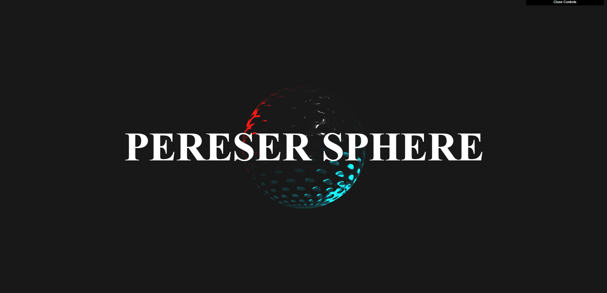

# Brincando com Three.JS

## Para rodar
Necessário do [Node.js](https://nodejs.org/en/download/).
Depois utilize esses comandos:

``` bash
# Instalar as dependencias 
npm install

# O Servidor ira abrir no localhost:8080
npm run dev


```
